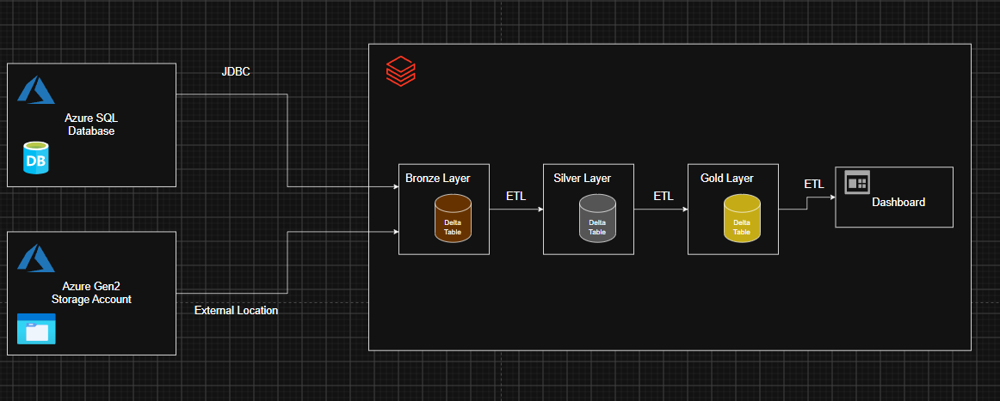
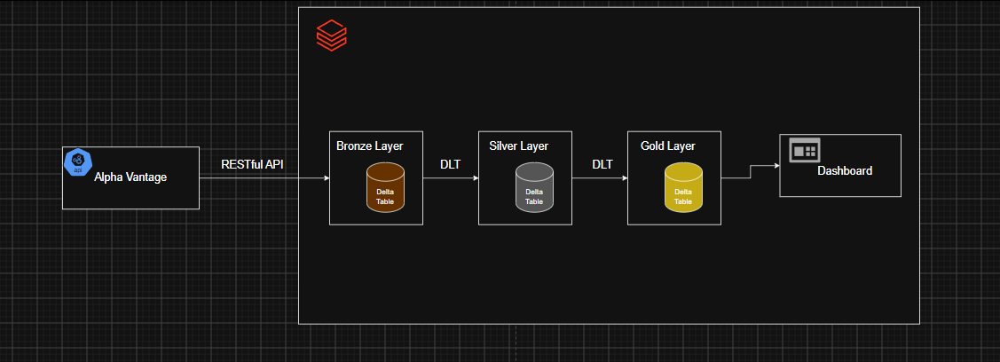

# Introduction
This project demonstrates the design and implementation of two end-to-end data engineering pipelines in Databricks, each addressing a different analytical use case and ingestion pattern.

The first pipeline processes financial transaction data from multiple sources to create analytics-ready datasets for investigating fraudulent activity. Data is ingested from sources including cloud object storage and Azure SQL Database, transformed through a Bronze, Silver, and Gold Medallion Architecture, and ultimately used to produce a fraud analytics dashboard.

The second pipeline uses Databricks Lakeflow Declarative Pipelines (DLT) to process stock-market data for four publicly traded companies (Apple, Google, Microsoft, and Tesla). Historical price and trading-volume data is transformed into analytical datasets measuring short-, medium-, and long-term market movements. The resulting datasets are used to build a stock-market analytics dashboard.

Together, the two pipelines demonstrate multiple approaches to data ingestion, transformation, analytical modeling, and visualization within the Databricks Lakehouse environment.

# Technologies
- Databricks
- Microsoft Azure
- Python
- Apache Spark
- PySpark
- DLT
- JDBC
- RESTful API

# Implementation

## Architecture

### ETL Pipeline
The fraud analytics pipeline follows a Medallion Architecture, separating data ingestion, transformation, and analytical processing across Bronze, Silver, and Gold layers.

Transaction data is ingested from multiple sources, including JSON data stored in cloud object storage and relational data from Azure SQL Database through JDBC. The Bronze layer preserves the ingested data in its raw form, providing a consistent starting point for downstream processing.

The Silver layer uses PySpark to clean, standardize, validate, and integrate the transaction data. This includes handling data types, missing values, duplicate records, timestamps, and inconsistencies between the different source datasets.

The Gold layer transforms the cleaned transaction data into purpose-built analytical datasets. These datasets contain aggregated metrics and behavioral features required by the fraud analysis and are consumed by the final Databricks dashboard.

### DLT Pipeline

The stock-market pipeline is implemented using Databricks Lakeflow Declarative Pipelines (DLT) and follows a Bronze, Silver, and Gold architecture.

Daily market data for Apple, Google, Microsoft, and Tesla is retrieved through a Alpha Vantages API. The data contains historical price and trading-volume information and is ingested into the Bronze layer before being processed by the declarative pipeline.

The Silver layer standardizes the raw market data by converting dates, prices, and trading volumes into appropriate data types and preparing the records for time-series analysis.

The Gold layer uses PySpark window operations to derive analytical metrics describing price and volume movements over 5, 30, and 90 day periods. These curated datasets provide the source for the stock-market dashboard.

Using DLT allows the transformations and dependencies between the different layers to be defined declaratively, allowing Databricks to manage the execution flow between pipeline datasets.

## Analysis
### ETL Pipeline
The fraud analytics pipeline transforms raw financial transaction data into curated datasets designed to investigate fraudulent activity from multiple perspectives.

The analysis focuses on questions such as:

How does fraudulent activity vary across different times and periods?
Which customers demonstrate unusually high levels of fraudulent activity?
Are there changes in transaction frequency or amount leading up to fraudulent transactions?
Which users demonstrate significant transaction spikes relative to their typical behavior?
What behavioral and transactional patterns distinguish fraudulent activity within the dataset?

These analytical datasets are produced in the Gold layer and consumed by a Databricks dashboard, allowing fraud patterns, customer behavior, and transaction anomalies to be explored visually.

[View ETL Pipeline](./ETL%20Pipeline/)

### DLT Pipeline
The stock-market pipeline analyzes historical price and trading-volume behavior across Apple, Google, Microsoft, and Tesla.

The Gold layer derives metrics across multiple time horizons to provide both shorter- and longer-term views of market movement. The analysis includes:

- 5-day price change
- 30-day price change
- 90-day price change
- 5-day percentage price change
- 30-day percentage price change
- 90-day percentage price change
- 5-day volume change
- 30-day volume change
- 90-day volume change
Comparison of price and volume behavior across the four stocks

These metrics are exposed through a Databricks dashboard, allowing price movements and changes in trading activity to be compared across companies and time periods.

[View DLT Pipeline](./DLT%20Pipeline/)

# Improvements
Several improvements could extend the pipelines toward more scalable and production-oriented implementations:
1. **Pipeline Monitoring and Alerting:** Introduce monitoring for pipeline failures, processing latency, record counts, and data-quality violations, with automated alerts when abnormal pipeline behavior is detected.
2. **Automated Stock Data Collection:** Schedule API ingestion and DLT execution so newly available market data automatically flows through the Bronze, Silver, and Gold layers and refreshes the downstream dashboard.
3. **Predictive Analytics:** Extend the curated datasets into machine-learning use cases, such as fraud-risk classification or additional financial-market modeling based on historical price and volume features.