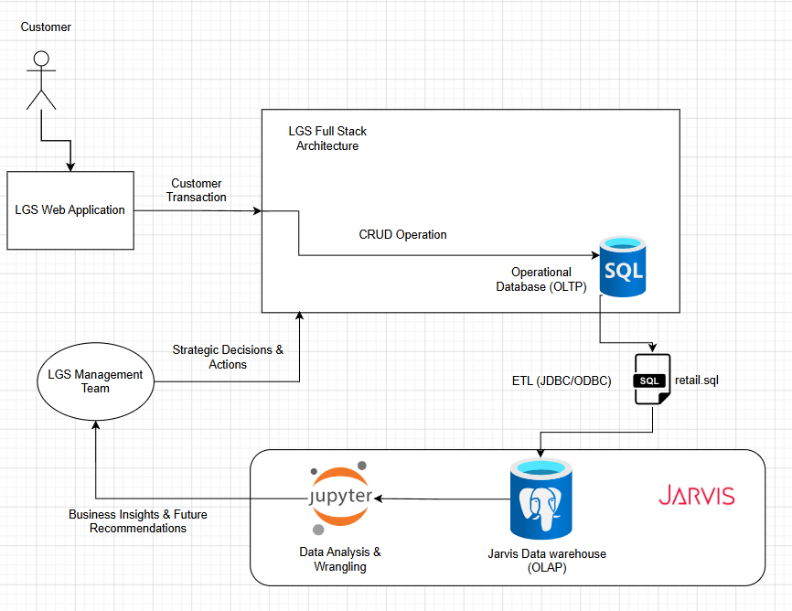

# Introduction

## Business Context

London Gift Shop (LGS) is a UK-based online retailer specializing in giftware products. The company has been operating for over 10 years; however, revenue growth has remained relatively stagnant in recent years. As a result, the marketing team seeks to better understand customer purchasing behavior and identify opportunities for more targeted marketing initiatives. To support these efforts, LGS has collected historical customer transaction data that can be analyzed to uncover trends, patterns, and actionable business insights.

## Business Value

The results of this analysis can help LGS make more informed business decisions by identifying trends, customer behaviors, and revenue opportunities. Insights such as seasonal purchasing patterns, geographic revenue concentration, and customer purchasing and engagement patterns can be used to support marketing campaigns, loyalty program initiatives, and resource allocation decisions.

For example, LGS can use seasonal sales insights to target promotions during low-demand periods, while geographic analysis can help identify opportunities to expand into underperforming markets. These data-driven recommendations enable LGS to increase customer engagement and maximize revenue.

## Technologies Used

This project was developed using Jupyter Notebook and Python as the primary analytics environment.

Technologies and libraries used include:

* PostgreSQL Data Warehouse (Jarvis)
* Python
* Jupyter Notebook
* Pandas for data cleaning and transformation
* NumPy for numerical analysis
* Matplotlib for data visualization
* Exploratory Data Analysis (EDA)
* RFM Customer Segmentation

The project follows a complete analytics workflow consisting of data extraction, cleaning, transformation, analysis, visualization, and business insight generation.

# Implementation

## Project Architecture

The architecure of the project follows the following stages: 
1. Customer transaction/sales data collected and stored on the LGS operational database.
2. Transactional data is extracted from the operational database and loaded into the Jarvis Data Warehouse through an ETL process using JDBC/ODBC connections.
3. Analysts access the data warehouse through Jupyter Notebook to perform data wrangling, exploratory analysis, and customer segmentation.
4. Impactful Buisness Insights are generateed as a result of the analytics which are presneted to the LGS Management Team
5. LGS Mnagaement Team can process the insights and make approriate business strategy decisions and actions.  

### Architecture Diagram

## Data Analytics and Wrangling

The complete analytics workflow is available in the Jupyter Notebook:

[retail_data_analytics_wrangling.ipynb](./python_data_analytics/python_data_wrangling/retail_data_analytics_wrangling.ipynb)

### Revenue Growth Opportunities

From the above notebook there were several analytical findings which can help LGS increase their revenue:

* Develop targeted promotions during off-season periods to reduce seasonal revenue fluctuations.
* Expand marketing efforts into underrepresented geographic markets to reduce dependency on the UK market.
* Strengthen customer retention programs to encourage repeat purchases and increase customer lifetime value.
* Improve data quality controls to support more accurate reporting and business decision-making.

# Improvements

If additional time were available, the following enhancements would be implemented:

1. Develop predictive machine learning models to forecast customer purchases and future revenue trends.

2. Build an interactive dashboard using Power BI to provide real-time business intelligence and KPI monitoring.

3. Integrate additional customer data sources such as demographics, and website activity to improve segmentation accuracy and marketing effectiveness.

